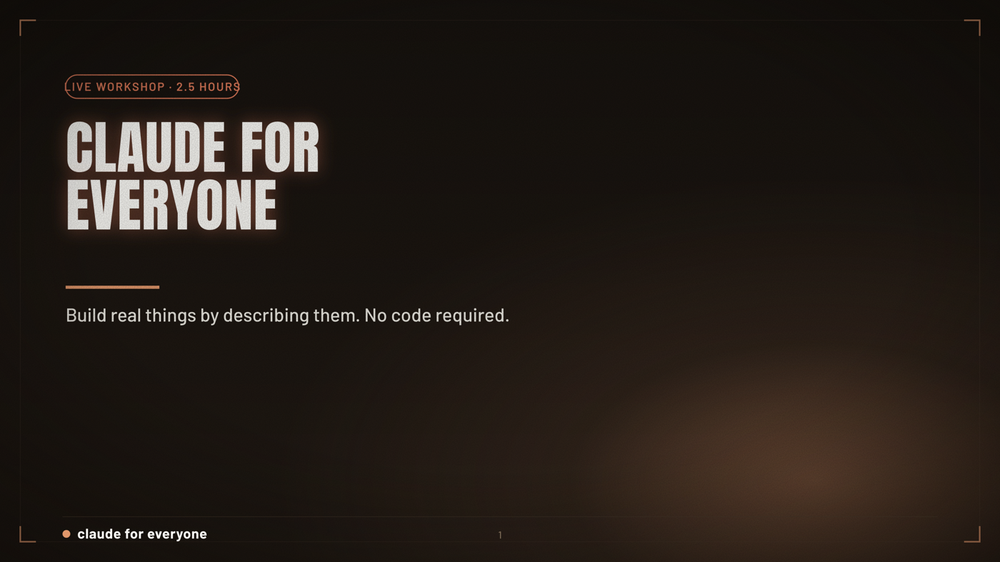
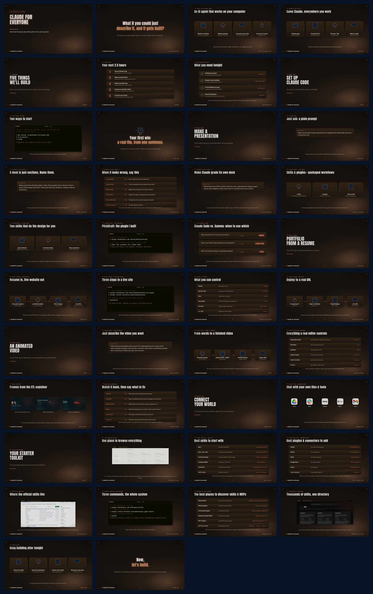
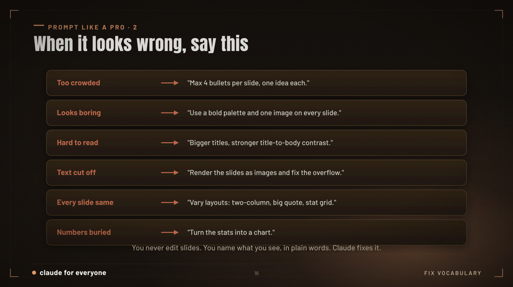
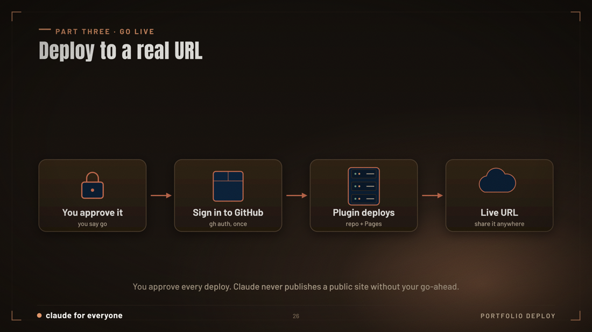
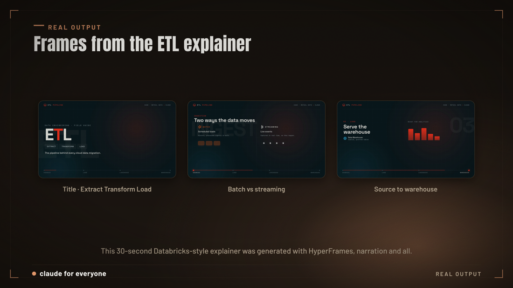

# Claude Code for Everyone



A beginner-friendly workshop that teaches you to **build real things by describing them**, with no coding required. You talk, Claude Code does the work in real files, and you refine in plain English.

By the end you will have made three things from scratch:

1. **A presentation**, from a plain prompt to a polished, on-brand deck
2. **A portfolio website**, drop in your resume and get a live URL to share
3. **An explainer video**, describe the scenes and get real animation with narration

> **The one idea, repeated all night:**
> **Describe what you want, look at what it made, describe the fix.**
> Every build is the same loop. Learn it once, use it forever.

---

## What's inside

| Folder | What it is |
|---|---|
| [`deck/`](deck/) | The full workshop slide deck: [PDF](deck/Claude-for-Everyone.pdf) for quick viewing, plus [PowerPoint](deck/Claude-for-Everyone.pptx) |
| [`guides/`](guides/) | Step-by-step, prompt-first guides for each build |
| [`prompts/`](prompts/cheatsheet.md) | The copy-paste prompt cheatsheet, the words that fix anything |
| [`video/`](video/) | The actual ETL explainer video made in the workshop |
| [`resources.md`](resources.md) | Where to find the best skills, plugins, and connectors |



---

## Before you start (prerequisites)

You only need three things. The first two are quick; do the GitHub one ahead of time.

1. **A Claude account**, a Pro or Max plan unlocks skills and plugins, [claude.ai](https://claude.ai)
2. **Claude Code installed**, the desktop app (easiest) or the terminal CLI, [code.claude.com](https://code.claude.com)
3. **A free GitHub account**, to publish your portfolio and sites, [github.com](https://github.com)

> Free tier works for basic prompting, but **skills and plugins need Claude Pro or Max**.

---

## The three builds

Each guide is **prompt-first**: the exact things to type, in order, with how to review and improve.

### 1. [Make a presentation](guides/01-make-a-presentation.md)

Plain prompt, fix it by talking, official skills, my custom **PitchCraft** plugin, then the Gamma alternative.



### 2. [Build a portfolio website](guides/02-build-a-portfolio.md)

Drop a resume PDF, run my **portfolio-pro** plugin, pick a theme, deploy to a live GitHub Pages URL.



### 3. [Create an explainer video](guides/03-create-a-video.md)

Describe the video (the ETL example), HyperFrames renders it with narration, then you review and improve.



---

## The mental model

Everything in this workshop is the same three steps:

```
Describe  ->  Look  ->  Refine
```

You never edit files by hand. You **describe the problem you see** in plain words, and Claude fixes it. The [cheatsheet](prompts/cheatsheet.md) gives you the exact words for when something looks wrong.

---

## Credits

Built for the **Claude Code for Everyone** workshop. Custom plugins used:

- **PitchCraft**, cinematic decks, [github.com/fnusatvik07/pitchcraft](https://github.com/fnusatvik07/pitchcraft)
- **portfolio-pro**, resume to live site, [github.com/fnusatvik07/portfolio-pro-plugin](https://github.com/fnusatvik07/portfolio-pro-plugin)

Share freely.
